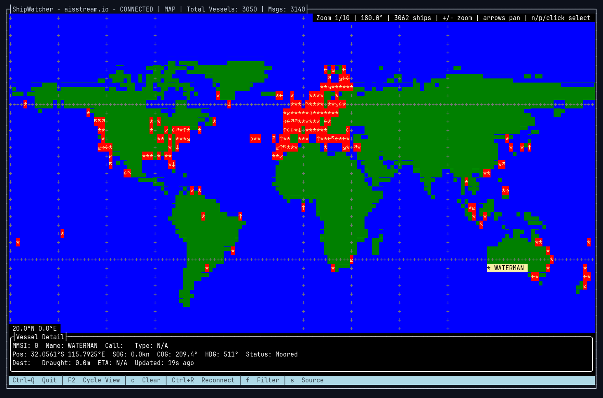
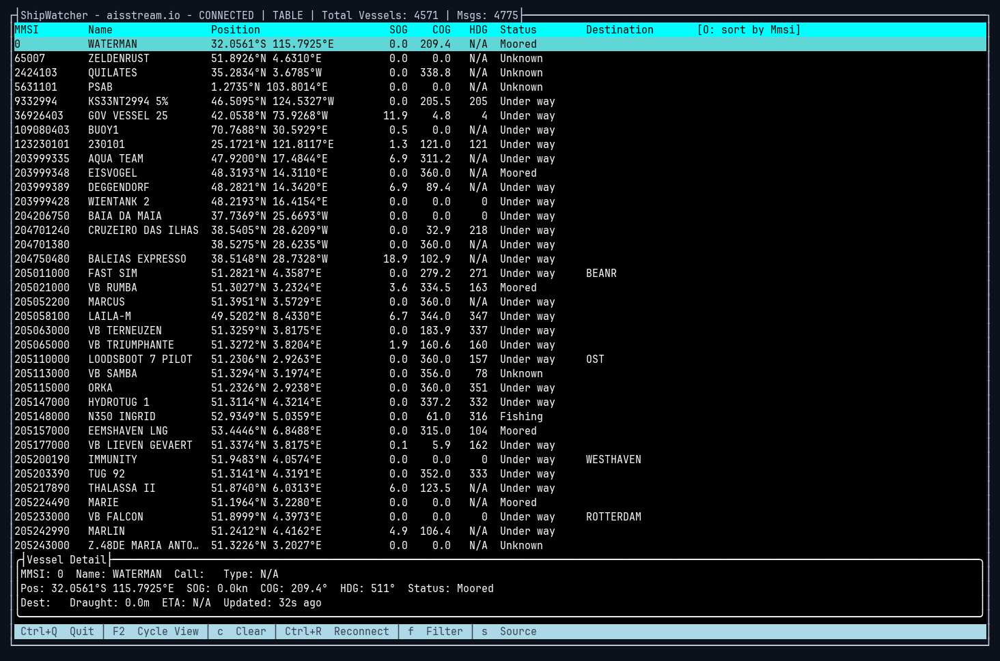

# ShipWatcher.NET

A terminal-based live AIS vessel tracker built with [Terminal.Gui](https://github.com/tui-cs/Terminal.Gui) v2. Watch ships move on an ASCII map or browse them in a sortable table, fed by free real-time AIS data sources.

Requires the .NET 10 SDK.

## Screenshots

The map view, tracking ~3,000 vessels worldwide on the aisstream.io feed, with a selected vessel shown in the detail panel:



The table view of the same session, sortable by column:



## Data Sources

The system supports multiple AIS data sources:

1.  **Kystverket (Norway)**: Free, open real-time TCP stream for the Norwegian Economic Zone. No registration required.
2.  **Digitraffic (Finland)**: Free, open REST API for Finnish waters, polled on a configurable interval. No registration required.
3.  **BarentsWatch (Nordic/Baltic)**: Free JSON stream for Norway, Sweden, Denmark, Iceland, and Estonia. Requires a free account.
4.  **aisstream.io**: Global real-time WebSocket feed. **Requires a free API key** from [aisstream.io](https://aisstream.io).

See `docs/` for research notes on AIS providers and free tracking options.

## Configuration

Press **S** in the app to switch sources and edit per-source settings:

- **Kystverket**: stream host and port.
- **Digitraffic**: poll interval in seconds.
- **aisstream.io**: API key.

Environment variables:

- `AISSTREAM_API_KEY`: Your API key for aisstream.io.
- `SHIPWATCHER_LAT_MIN`, `SHIPWATCHER_LON_MIN`, `SHIPWATCHER_LAT_MAX`, `SHIPWATCHER_LON_MAX`: Bounding box for aisstream.io tracking.

## Usage

Run the application:
```bash
dotnet run --project ShipWatcher.NET
```

### Global keys

- **F2**: Cycle between Map and Table views (selection is carried across).
- **S**: Change data source and configuration.
- **F**: Filter vessels by name or MMSI.
- **C**: Clear all tracked vessels.
- **Ctrl+R**: Reconnect to the active source.
- **Ctrl+Q**: Quit.

### Map view

- **Arrow keys**: Pan the map.
- **+ / -**: Zoom in and out (numpad keys work too).
- **N / P**: Select the next / previous vessel.
- **Click** a ship to select it; **double-click** for details.

### Table view

- **O**: Cycle the sort column.

## Tests

```bash
dotnet test
```
